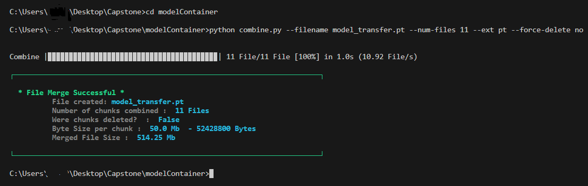
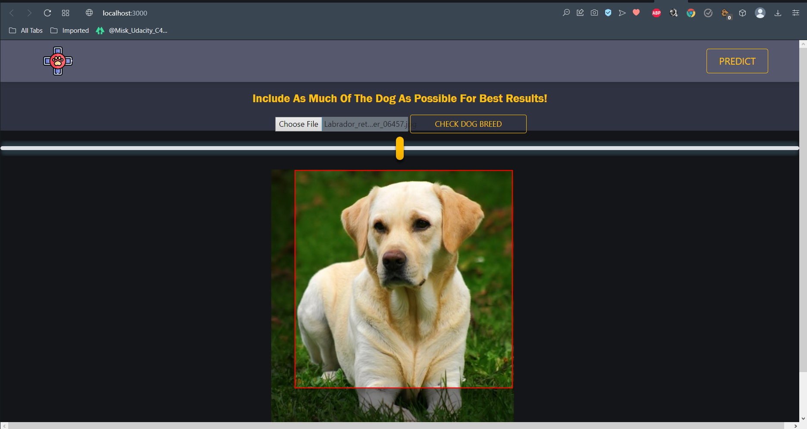
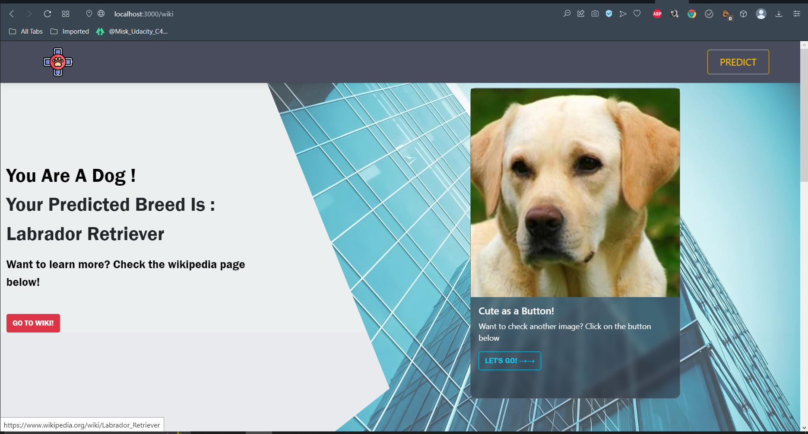
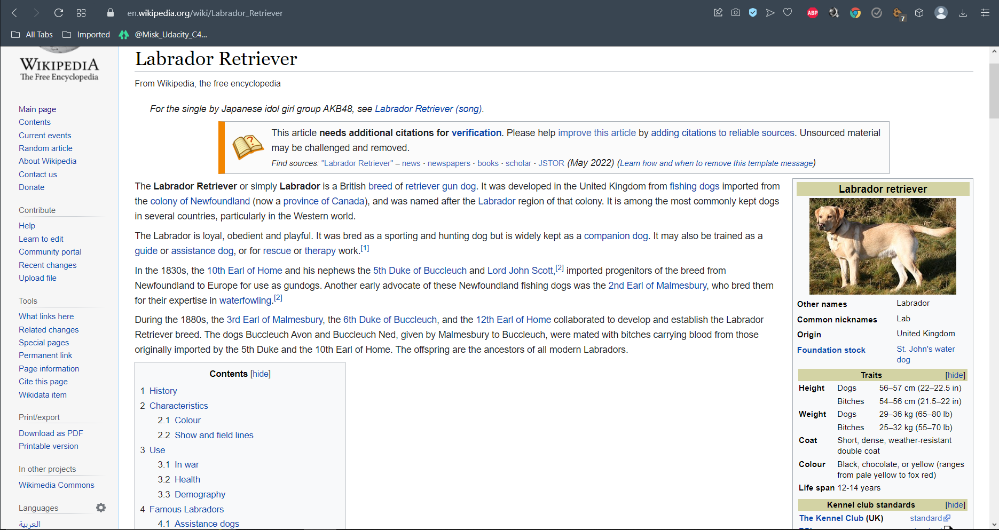

# Dog Breed Classifier

A trained machine learning model that predicts dog breeds using an image. It utilizes a FastAPI Python server and a React frontend to create a user interface for interacting with the model. Once a prediction is made, the server scrapes Wikipedia for a link to the dog breed's page.

## Installation
there are two ways to run this locally: 

#### 1. local direct install
I don't recommend this method as it might install and update several libraries. If you have a local environment you don't want to alter, it's better to avoid this approach.

However, if you wish to proceed:

```bash

cd CapstoneApp
```

```bash

pip install -r requirments.txt
```
You also need to install the front-end dependencies:
```bash

cd reactapp
```

```bash
npm install
```
##### Combine module
Due to GitHub limitations in handling large files, I created a script to separate the module into smaller chunks.

Navigate to the modelContainer folder and run this command:

```
python combine.py --filename model_transfer.pt --num-files 11 --ext pt --force-delete no
```


This will produce a model_transfer.pt file. move it into the "CapstoneApp" folder.

It should be in the same folder as the "server" python file.

### 2. Docker installation (recommended)

It's a substantial project that can interfere with your environment if installed directly. Particularly if you're working on React or Node.js projects locally, it might inadvertently update some libraries.

So instead of installing locally, use the docker-compose.yaml file instead to create two docker images and a container to run the application.

insure that you have Docker-desktop and [Docker](https://docs.docker.com/engine/install/) installed first.

After installing docker, you need to combine the module into a single file.

##### Combine module
Due to github limitation when handeling large files, i simply made a script to seperate the module into smaller files.

Navigate to the modelContainer folder and run this command:
```
python combine.py --filename model_transfer.pt --num-files 11 --ext pt --force-delete no
```


This will produce a model_transfer.pt file. move it into the "CapstoneApp" folder then run this command:

```
docker-compose up --build
```
This process will take some time. The project will download many large libraries and files, so feel free to take a break. Grab lunch, watch Jojo's Bizarre Adventure, or simply relax.

Eventually, the docker image building will complete, and the image will be up.

Use this URL in a browser to connect locally to the application:

```
http://localhost:3005/
```
# User Guide

###choosing an image

The application is straightforward:
You have a button that allows you to upload a picture of a dog or a human.



You can move the yellow line to zoom in and out for better focus on the dog. The red rectangle is the crop area.

After you are done moving and adjusting the image, click "Check Dog Breed" to predict the dog breed.



You will be directed to the next page where you will find out the prediction.

Notice the red button under the prediction text.
This is a link to the Wikipedia page of the dog breed, scraped using BeautifulSoup.




You can also upload images of humans to predict a human's corresponding dog breed!

So, have fun!


